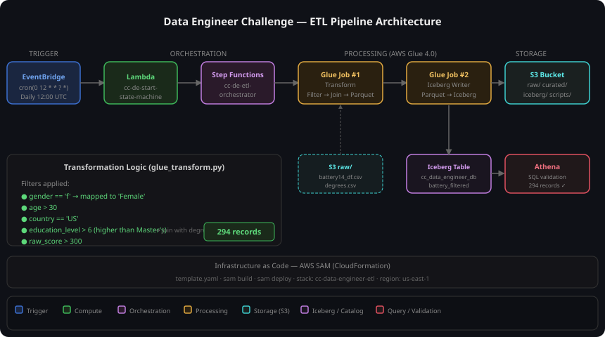

# Data Engineer Code Challenge


> This pipeline processes psychometric assessment results on a daily basis, applying configurable filters for segmented analysis — enabling business teams to re-run queries for different demographic criteria without touching any code or redeploying infrastructure.

---

## Architecture



```
EventBridge (cron)
│
▼
AWS Lambda ─── builds filter parameters
│
▼
Step Functions (orchestrator)
│
├── State 1: Glue Job #1 — Transform
│   • applies dynamic filters
│   • joins with degrees.csv
│   • 6 data quality checks
│   • writes Parquet → S3: curated/year=.../month=.../day=.../
│
└── State 2: Glue Job #2 — Iceberg Writer
    • reads Parquet from curated/
    • creates / overwrites Iceberg v2 table
    • registers in Glue Data Catalog
    • queryable via Amazon Athena

CloudWatch Alarm → SNS → Email (fires on any execution failure)
```

---

## Why these technologies?

| Component | Choice | Rationale |
|---|---|---|
| **Orchestration** | Step Functions | Provides visual execution graph, built-in retry/catch per state, and clean separation between transform and write stages — more maintainable than chaining Lambda calls |
| **Processing** | AWS Glue 4.0 | Managed Spark with native Iceberg support via `--datalake-formats`; no custom JARs needed and scales automatically with data volume |
| **Table format** | Apache Iceberg | ACID transactions, schema evolution, and time-travel queries out of the box — significantly more capable than plain Hive/Parquet for analytical workloads |
| **Scheduling** | EventBridge | Cron-native in AWS, serverless, and integrates directly with Lambda without additional infrastructure |
| **IaC** | AWS SAM / CloudFormation | Reproducible, version-controlled infrastructure; SAM simplifies Lambda packaging while CloudFormation manages the full stack lifecycle |
| **Storage** | Single S3 bucket | Simplifies IAM policies, reduces cross-bucket data transfer costs, and keeps all pipeline stages co-located with logical prefixes |

---

## Design decisions

**Dynamic filter parameters via Lambda** — filters are not hardcoded in any Glue script. The Lambda builds the complete parameter map and passes it through Step Functions to Glue as job arguments. Re-running with different criteria requires only a Lambda invocation, not a redeployment.

**Data quality checks as a gate** — six invariants are validated after filtering (null checks on all key columns, gender purity, age/education/score floor enforcement). Any violation raises `DataQualityError` and aborts the job before bad data can reach the curated zone or the Iceberg table.

The six invariants enforced are: no nulls on `gender`, `age`, `country`, `education_level`, and `raw_score`; and no null `degree_description` after the join with the reference table. Each check is logged individually so Glue output logs show exactly which invariant failed and on how many rows.

`education_level > 6` **for "higher than Master's degree"** — the dataset encodes degrees as integers (Bachelor's = 4, Master's = 6, Doctorate = 8). The requirement "higher than Master's" is `education_level > 6`, selecting Doctorate-level respondents. This is an explicit, documented interpretation.

**Apache Iceberg via `--datalake-formats iceberg`** — the Glue 4.0 built-in Iceberg extension is used instead of a custom JAR. Catalog configuration is applied via `spark.conf.set()` at runtime, avoiding the multi-line `--conf` argument that CloudFormation cannot serialize as a string value.

**Lazy boto3 client in Lambda** — `boto3.client("stepfunctions")` is created inside `lambda_handler()` rather than at module level. This allows `moto` to intercept the client during unit tests without a real AWS endpoint active.

**CloudWatch Alarm with OK action** — the alarm notifies on both ALARM and OK state transitions, so the on-call engineer receives a recovery notification automatically without checking the console.

**Single S3 bucket with logical prefixes** — `raw/`, `curated/`, `iceberg/`, `scripts/`, `athena/`, `tmp/`. Simplifies IAM, reduces cost, and keeps all pipeline data co-located.

**Failure and recovery behaviour** — if the Transform job fails, Step Functions marks the execution as FAILED and stops before the Iceberg Writer runs, so the curated Parquet and the Iceberg table are never overwritten with partial data. Each execution writes to a date-partitioned path (`curated/year=.../month=.../day=.../`), so re-running with the same `executionDate` is idempotent: it overwrites only that day's partition, leaving all other dates intact. CloudWatch triggers the SNS alert on any FAILED execution, giving the on-call engineer the execution ARN needed to diagnose and reprocess.

---

## Pipeline metrics

| Metric | Value |
|---|---|
| Raw dataset size | 47,645 rows |
| Output records (default filters) | 294 rows |
| Unit tests | 13 passed, 100 % Lambda coverage |
| Estimated cost per execution | ~$0.05 USD (Glue DPU + Lambda + Step Functions) |
| Deployment time (cold start) | ~4–5 min (SAM build + CloudFormation) |
| End-to-end pipeline duration | ~3–4 min (Glue jobs) |

---

## Assumptions & limitations

- **Education encoding is ordinal and static** — `education_level` is assumed to be a stable integer mapping (4 = Bachelor's, 6 = Master's, 8 = Doctorate). In production, this mapping should come from a centralized configuration table to support schema evolution.
- **Single AWS region** — the pipeline is deployed to `us-east-1` only. A multi-region setup would require replicating the S3 bucket and Glue catalog, which is out of scope for this challenge.
- **No incremental processing** — the pipeline performs a full overwrite of the Iceberg table on each run. For large datasets, a merge/upsert strategy based on a surrogate key would be more efficient.
- **IAM uses managed policies for simplicity** — the `sam-deployer` user has broad managed policies for ease of deployment. In production, least-privilege inline policies per resource would be enforced.
- **Default gender filter is female** — the `filterGender` default is `f` (Female) as interpreted from the challenge requirements. This is configurable at invocation time with no code changes.

---

## Prerequisites

| Requirement | Notes |
|---|---|
| Docker Desktop | The only local dependency |
| AWS credentials | Access Key ID + Secret Access Key for the `sam-deployer` IAM user |

### IAM permissions for `sam-deployer`

Attach these managed policies to the deployer user:

- `AWSCloudFormationFullAccess`
- `AWSLambda_FullAccess`
- `AmazonS3FullAccess`
- `AWSGlue_FullAccess`
- `AWSStepFunctionsFullAccess`
- `IAMFullAccess`
- `AmazonEventBridgeFullAccess`
- `CloudWatchFullAccess`

Plus an inline policy granting `sns:CreateTopic`, `sns:Subscribe`, `sns:GetTopicAttributes`, `sns:SetTopicAttributes`, `sns:DeleteTopic`, `sns:ListTagsForResource`, `sns:TagResource`, `sns:Unsubscribe` on `arn:aws:sns:us-east-1:<ACCOUNT_ID>:cc-de-pipeline-alerts`.

---

## Quick Start

The only requirement is Docker Desktop running on your machine. Python, AWS CLI, and SAM CLI are all provided by the container — nothing else to install.

```bash
# 1. Clone the repo
git clone https://github.com/sochoag/AWS-Data-Engineer-Code-Challenge && cd AWS-Data-Engineer-Code-Challenge

# 2. Create your credentials file
cp .env.example .env
# Open .env and fill in AWS_ACCESS_KEY_ID and AWS_SECRET_ACCESS_KEY

# 3. Run the full pipeline
docker compose up --build
```

That's it. `docker compose up --build` handles everything in order:

1. Build the Docker image (Python 3.11 + AWS CLI v2 + SAM CLI)
2. Validate credentials from `.env`
3. Install Python test dependencies
4. Run the unit test suite — 13 tests, 100 % Lambda coverage (pytest + moto)
5. `sam build` — packages the Lambda function
6. `sam deploy` — provisions all AWS infrastructure via CloudFormation
7. Upload CSVs and Glue scripts to S3
8. Trigger the ETL pipeline via Lambda invocation
9. Print direct console links + Athena queries to verify results

### Optional `.env` flags
```bash
# Enable failure-alert email (CloudWatch → SNS)
ALERT_EMAIL=you@example.com

# Run tests only — skip deploy (useful for CI or re-runs)
SKIP_DEPLOY=1
```

### Teardown — remove all AWS resources
```bash
docker compose -f docker-compose.teardown.yml run --rm teardown
```

Empties the S3 bucket (objects + versions) then deletes the entire CloudFormation stack. Prompts for confirmation before making any changes.

---

## Running the tests manually

```bash
# Via Docker (no local Python needed)
SKIP_DEPLOY=1 docker compose up --build
```

Expected output:

```
tests/test_lambda.py::TestBuildSfnInput::test_empty_event_uses_all_defaults PASSED
tests/test_lambda.py::TestBuildSfnInput::test_execution_date_defaults_to_today PASSED
tests/test_lambda.py::TestBuildSfnInput::test_execution_date_override PASSED
tests/test_lambda.py::TestBuildSfnInput::test_gender_filter_override PASSED
tests/test_lambda.py::TestBuildSfnInput::test_education_min_override PASSED
tests/test_lambda.py::TestBuildSfnInput::test_multiple_overrides_applied_independently PASSED
tests/test_lambda.py::TestBuildSfnInput::test_all_values_are_strings PASSED
tests/test_lambda.py::TestBuildSfnInput::test_raw_bucket_always_set PASSED
tests/test_lambda.py::TestBuildSfnInput::test_unknown_event_keys_are_ignored PASSED
tests/test_lambda.py::TestLambdaHandler::test_successful_invocation_returns_200 PASSED
tests/test_lambda.py::TestLambdaHandler::test_execution_name_contains_date PASSED
tests/test_lambda.py::TestLambdaHandler::test_parameters_reflect_overrides PASSED
tests/test_lambda.py::TestLambdaHandler::test_default_gender_filter_is_female PASSED

13 passed — coverage: 100 %
```

---

## Dynamic filter overrides

Every filter is configurable at invocation time — no code changes or redeployment needed.

**From the AWS Console:**

1. Open Lambda → `cc-de-start-state-machine` → Test
2. Create a test event with any combination of overrides:
```json
{
  "filterGender": "m",
  "filterAgeMin": "25",
  "filterCountry": "US",
  "filterEducationMin": "4",
  "filterRawScoreMin": "200",
  "executionDate": "2026-01-15"
}
```
3. Click **Test** — the Lambda starts a new Step Function execution with the overridden parameters. Any key not provided falls back to its default.

**Default filter values:**

| Parameter | Default | Description |
|---|---|---|
| filterGender | f | Gender code (f = Female, m = Male) |
| filterAgeMin | 30 | Exclusive minimum age |
| filterCountry | US | Country code |
| filterEducationMin | 6 | Exclusive minimum education level (6 = Master's) |
| filterRawScoreMin | 300 | Exclusive minimum raw score |
| executionDate | today (UTC) | Processing date, used for S3 partitioning |

**From the AWS CLI:**

```bash
aws lambda invoke \
  --function-name cc-de-start-state-machine \
  --payload '{"filterGender":"m","filterAgeMin":"25"}' \
  --cli-binary-format raw-in-base64-out \
  --profile sam-deployer \
  response.json && cat response.json
```

---

## How to check all requirements

### 1. EventBridge schedule

Navigate to **EventBridge → Rules → cc-de-daily-trigger**. Confirms: `cron(0 12 * * ? *)` (daily at 12:00 UTC), target = Lambda `cc-de-start-state-machine`.

### 2. Step Function execution

Navigate to **Step Functions → State machines → cc-de-etl-orchestrator**. Open the latest execution — both `TransformJob` and `IcebergJob` states must be green (SUCCEEDED). The execution input panel shows all filter parameters passed from Lambda.

### 3. Glue Jobs

Navigate to **Glue → ETL Jobs**. Both `cc-de-glue-transform` and `cc-de-glue-iceberg` must show `Succeeded` for the latest run. Click a run → Output logs to see the data quality check results per column.

### 4. S3 output — curated Parquet
```bash
aws s3 ls s3://cc-data-engineer-<ACCOUNT_ID>-us-east-1/curated/ \
  --recursive --profile sam-deployer
```

Expected: Parquet part-files under `curated/year=.../month=.../day=.../`.

### 5. Iceberg table in Athena

Open **Athena → Query Editor**. Set the output location to: `s3://cc-data-engineer-<ACCOUNT_ID>-us-east-1/athena/`

```sql
-- Expected: 294
SELECT COUNT(*) AS total
FROM cc_data_engineer_db.battery_filtered;

-- Confirms table is Iceberg (not Hive)
SHOW TBLPROPERTIES cc_data_engineer_db.battery_filtered;

-- Verify all filters were applied correctly
SELECT
  gender,
  country,
  COUNT(*) AS records,
  MIN(age) AS min_age,
  MIN(raw_score) AS min_raw_score,
  MIN(CAST(education_level AS INTEGER)) AS min_education
FROM cc_data_engineer_db.battery_filtered
GROUP BY gender, country;
```

Expected result:

| gender | country | records | min_age | min_raw_score | min_education |
|---|---|---|---|---|---|
| Female | US | 294 | 31 | 301 | 7 |

### 6. CloudWatch Alarm

Navigate to **CloudWatch → Alarms → cc-de-etl-pipeline-failure**. State should be `OK`. If `ALERT_EMAIL` was provided at deploy time, confirm the SNS subscription from the email AWS sent you.

### 7. Teardown — remove all AWS resources
```bash
docker compose -f docker-compose.teardown.yml run --rm teardown
```

Empties the S3 bucket (objects + versions) then deletes the entire CloudFormation stack.

---

## Project structure

```
so_code_challenge/
├── data/
│   ├── battery14_df.csv          # Raw psychometric dataset (47,645 rows)
│   └── degrees.csv               # Education level reference table
├── glue/
│   ├── glue_transform.py         # Glue Job #1: filter, join, DQ checks, write Parquet
│   └── glue_iceberg.py           # Glue Job #2: Iceberg writer
├── lambda/
│   └── start_state_machine/
│       └── app.py                # Builds filter params, starts Step Function
├── statemachine/
│   └── etl_orchestrator.asl.json # Step Functions ASL definition
├── scripts/
│   ├── upload_data.py            # Uploads CSVs + Glue scripts to S3
│   └── teardown.py               # Empties S3 + deletes CloudFormation stack
├── tests/
│   ├── conftest.py               # pytest fixtures (moto AWS mocks)
│   └── test_lambda.py            # 13 unit tests — 100 % Lambda coverage
├── docs/
│   └── architecture.svg          # Architecture diagram
├── .devcontainer/
│   ├── Dockerfile                # Python 3.11, AWS CLI v2, SAM CLI
│   └── devcontainer.json         # VS Code Dev Container config
├── template.yaml                 # SAM / CloudFormation — all AWS resources
├── samconfig.toml                # SAM CLI deploy defaults
├── requirements.txt              # Python dev/test dependencies
├── .env.example                  # Credentials template — copy to .env to get started
├── docker-compose.yml            # Main entry point — builds image and runs pipeline
├── docker-compose.teardown.yml   # Teardown entry point — removes all AWS resources
├── entrypoint.sh                 # Validates .env, writes AWS credentials, launches run.sh
├── teardown_entrypoint.sh        # Validates .env, writes AWS credentials, launches teardown.py
└── run.sh                        # Full pipeline: tests → build → deploy → trigger
```
